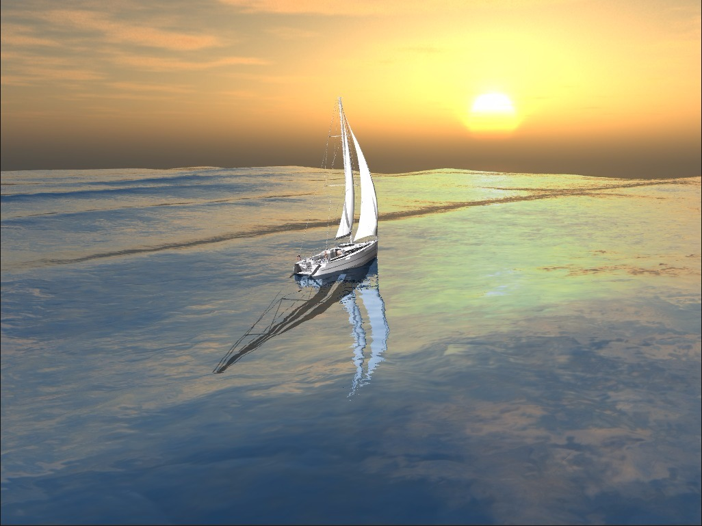

# Cast-Off - The Sailing Simulator

***At a glance***:
Cast-Off is a small sailing simulator that tries to simulate the main effects that occur during sailing on the ocean, such as the interaction between the boat and the waves and the influence of the wind on the sails.

***Gameplay informations***:
The sound of the howling wind depends on the strength of the wind-see gameplay instructions for how to change the strength of the wind. The player can steer the boat. Please keep in mind that sailing against the wind is physically impossible and result in a speed of 0 knots.

developed by
* Hannes Hergeth
* Markus Kohout
* Lukas Neuberger

## Gameplay Instructions
The game starts with an initial strength of the wind of 5 m/s (3 Bft) that is a rather comfortable strength to sail. You can increase or decrease the strength of the wind by using the keys mentioned below. The direction of the wind will change over time slightly as it does in the real world.

### Key Layout
* Increase Wind Strength: ***.***
* Decrease Wind Strength: ***,***

* Steer Left ***Left Arrow***
* Steer Right ***Right Arrow***

* Remove the sheet of the head sail ***K***

* Press ***M*** to listen to some sailor music

To rotate the camera around the sailing boat, press ***MIDDLE MOUSE BUTTON*** and move the mouse. To zoom in, use the ***MOUSE WHEEL***.

## Building
The underlying build system is CMake, so building is pretty straightforward. ***Please ensure that the build type is set to release (CMAKE_BUILD_TYPE)***.

### Building under Windows, MacOS
Use the CMake GUI to generate a project file for the IDE of your choice. Press the "Build" button in your IDE, play.

### Building under Linux
Use the CLI and go to the main directory of this project. Type in "cmake .; make". After the compilation has been finished, switch to bin/ and execute the sailing-simulator file."

## Required Libraries and Versions
* [Bullet](http://bulletphysics.org/) 2.8.3
* [glm](http://glm.g-truc.net/0.9.7/index.html) 0.9.7
* [TinyXML2](http://www.grinninglizard.com/tinyxml2/) 2.2.0
* [GLFW](http://www.glfw.org/) 3.1.2
* [GLEW](http://glew.sourceforge.net/) 1.13.0
* [Boost](http://www.boost.org) 1.5.9
* [SOIL](http://www.lonesock.net/soil.html)
* [FMOD](http://www.fmod.org) 1.07
